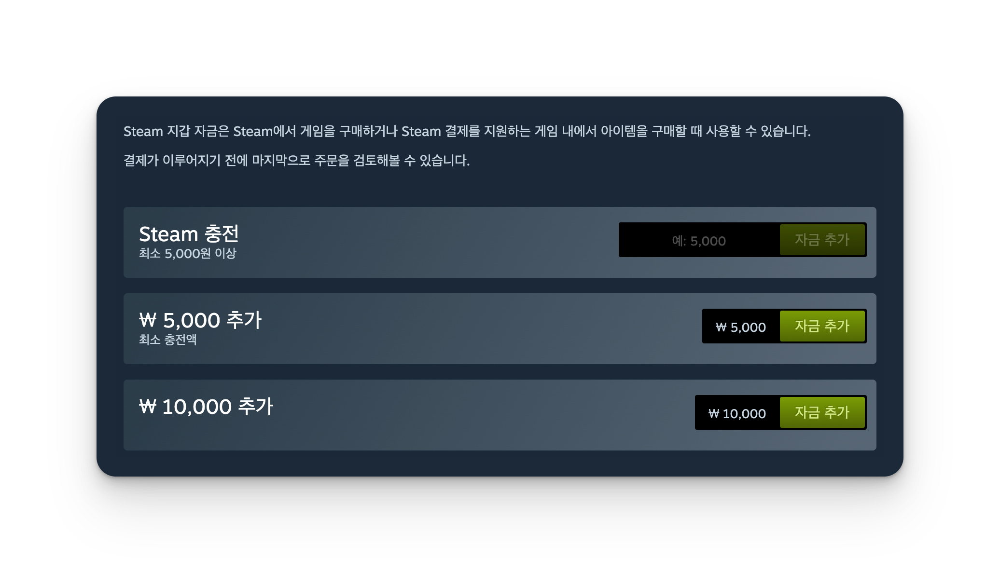

# Steam 충전 도우미

Steam 지갑에 원하는 금액을 자유롭게 충전할 수 있는 Chrome 확장 프로그램입니다.

## 기능

- 💰 커스텀 금액 입력 (최소 5,000원)

## 설치 방법

1. [코드 다운로드](https://github.com/daeho-ro/steam-addfunds-extension/archive/refs/heads/main.zip) 및 압축 해제
2. Chrome에서 `chrome://extensions/` 접속
3. 우측 상단 "개발자 모드" 활성화
4. "압축해제된 확장 프로그램을 로드합니다" 클릭
5. 압축 해제한 폴더 선택

## 사용 방법

1. https://store.steampowered.com/steamaccount/addfunds 접속
2. 상단의 "Steam 충전" 카드에서 원하는 금액 입력
3. "자금 추가" 버튼 클릭 또는 엔터 키 입력

## 기술 스택

- Vanilla JavaScript
- Chrome Extension Manifest V3

## 라이선스

MIT
